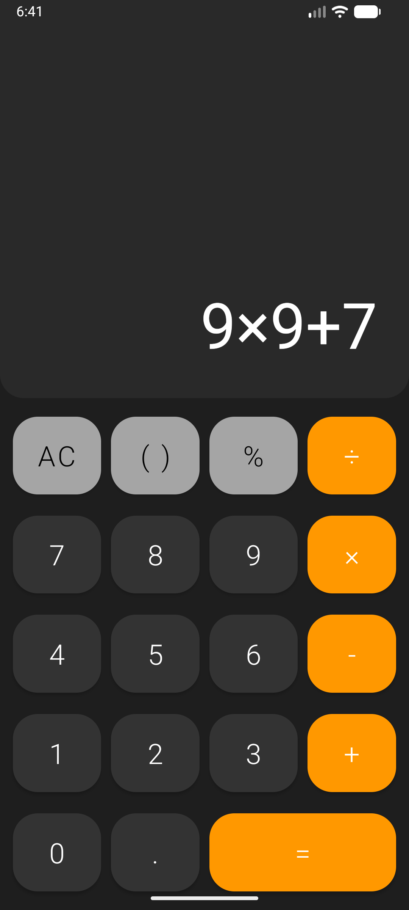

# Calculator

A simple yet functional calculator application for Android.

## Features

*   **Basic Arithmetic Operations:** Perform addition, subtraction, multiplication, and division.
*   **Advanced Functions:** Includes support for parentheses, percentages, and decimal points.
*   **User-Friendly Interface:** A clean and intuitive layout for a smooth user experience.
*   **Error Handling:** Displays an "ERROR" message for invalid expressions to prevent crashes.
*   **Horizontal Scrolling:** The display scrolls horizontally to accommodate long expressions.

## Screenshot

## How to Use

1.  Clone the repository.
2.  Open the project in Android Studio.
3.  Build and run the application on an Android device or emulator.

## Code Overview

*   **MainActivity.java:** The main activity of the application, responsible for handling user input and performing calculations.
*   **main_layout.xml:** The XML layout file that defines the user interface of the calculator.
*   **exp4j:** A third-party library used for evaluating mathematical expressions.

## Contributing

Pull requests are welcome. For major changes, please open an issue first to discuss what you would like to change.
